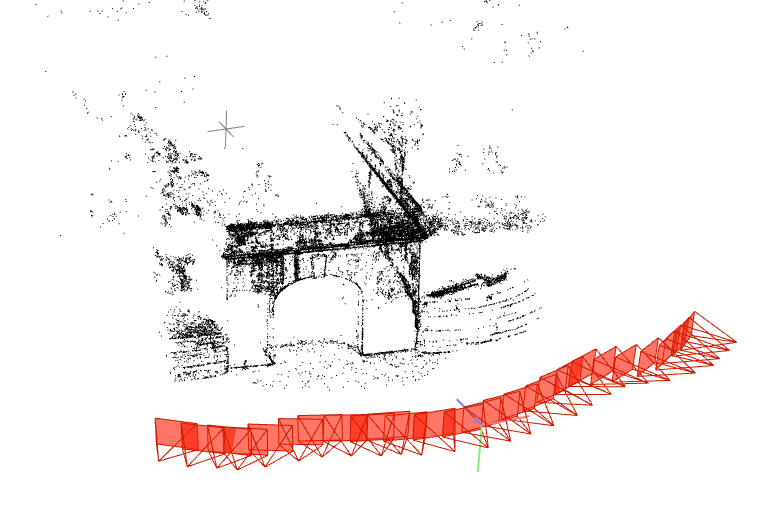

# Visual Localization 

## Environment

```sh
conda env create -f vloc.yml
```

## Download Data

```sh
cd data && ./download.ps1
```

## Instruction

- Reconstruction
- Localization

## Reconstruction

### Usage

- colmap_path: path of colmap
- work_space: path of the folder to place the output
- img_dir: path of the folder folder containing all images

```ps
python src/reconstruct.py --colmap_path /path/to/colmap --work_space /path/to/work_space --img_dir /path/to/image_folder
```
*e.g.*

```ps
python src/reconstruct.py --colmap_path "E:/software/COLMAP-3.7-windows-cuda/COLMAP.bat" --work_space "data/Fort_Channing_gate"  --img_dir  "data/Fort_Channing_gate/img"
```

During reconstruction, the following files will be generated `database.db`, `image-pairs.txt`, `log.txt`, `result.txt`

Once the reconstruction is done, the structure looks like this:
```
Fort_Channing_gate
├── image-pairs.txt
├── img
│   ├── DSC_0158.JPG
│   ├── DSC_0159.JPG
│   ├── DSC_0160.JPG
│   ├── DSC_0161.JPG
│   ├── DSC_0162.JPG
│   ....
├── log.txt
├── result.txt
├── database.db
└── sparse
    └── 0
        ├── cameras.txt
        ├── images.txt
        ├── points3D.txt
        └── project.ini
```
### Result

Fort_Channing_gate:




## Localization

The following steps are needed to localize an image:
- Preprocess (this procedure only needs to be excecuted once for each 3D model).
	- Load 3D model using `Model3D` class.
	- Call function `cluster_model3d` to classify model descriptors.
- Extract keypoints/descriptors from the image.
- Call function `localize`, which returns:
	- `status`: success or not
	- `rvec`: rotation vector
	- `tvec`: translation vector
	- `inliers`: number of inliers used for PnP
	- `corrs_total`: number of total correspondences used in PnP


An example could be found in file `localize.py`.

### Usage


- First extract features to a database file:
```ps
python src/gen_desc.py --database /path/to/database --img_list /path/to/image_list --desc_type "alike"
```

- Generate the visual words using kmeans:
```ps
python src/clusters.py --database /path/to/database --output /path/to/output_file(.npy)  --num_clusters number_of_clusters
```

- Localize:

```ps
python src/localize.py --database /path/to/database --model_dir /path/to/model3d --img_path /path/to/image --match_num_kps 5000
```
Please refer to `--help` for detailed controls.
