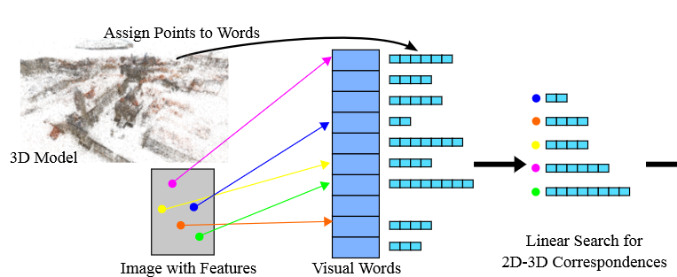

# Camera Localization

## Direct Matching-Based Methods

## Image Retrieval-Based Methods

### 1. Fast Image-Based Localization using Direct 2D-to-3D Matching (ICCV 2011)

**Prerequisite**
- Pretrained visual words
- Reconstructed 3D model

**Method**
- Store 3D points and their descriptors in a vocabulary tree
- Assign each image feature to a visual word
- Process the $N_t$ features that have the smallest numbers of potential 3D matches (*i.e.*, the descriptors of 3D points activate the same visual words)
- Estimate the camera pose with a PnP solver

**Matching**

There two manners for matching image features to 3D points:
- **3D-2D matching:** faster but less effective
- **2D-3D matching:** slower but more effective

To make 2D-3D matching faster:

> we propose a framework for efficient direct 2D-to-3D matching based on associating 3D points with a visual vocabulary obtained from clustering feature descriptors

- Assign each feature to a visual word
- For each $f_i$, collect all 3D points $\{P_k\}_{k=1}^{N_i}$ that are in the same visual word ($N_i$ could represents the cost of matching)
- Find $N_t$ features with the lowest cost, where $N_t$ is a preset parameter
- Matching features with the 3D points that are in the same visual work

    
