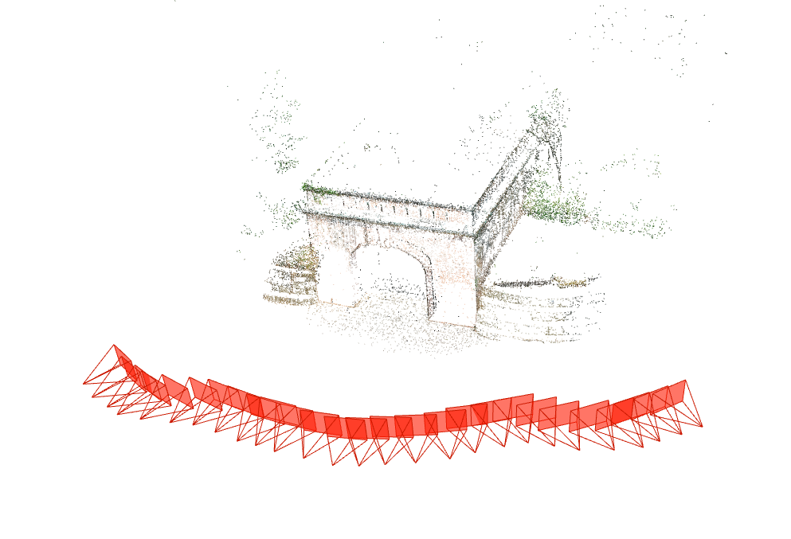

# Reconstruction

## Usage

```py
python ./src/reconstruct.py --colmap_path /path/to/colmap --work_space /path/to/work_space --img_dir /path/to/image_folder
```
*e.g.*

```
python ./src/reconstruct.py --colmap_path E:/software/COLMAP-3.7-windows-cuda/COLMAP.bat --work_space data\Fort_Channing_gate  --img_dir  data\Fort_Channing_gate\img
```

During reconstruction, the following files will be generated `database.db`, `image-pairs.txt`, `log.txt`, `result.txt`

Once the reconstruction is done, the structure looks like this (* denotes the generated folders/files): 
```
workspace
  ├─sparse  
  │   └─0  
  ├─image-pairs.txt  
  ├─database.db  
  ├─log.txt  
  └─result.txt  
```
## Result

Fort_Channing_gate:


